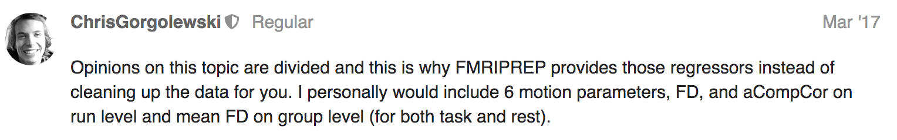

.. _univariate:

============================================
Univariate regression and temporal filtering
============================================

.. raw:: html

    
    

.. role:: blue
.. role:: red

Using the confound matrix from fmriprep
---------------------------------------

*Which confounds to use?*

`FMRIprep outputs <https://fmriprep.readthedocs.io/en/stable/outputs.html#confounds>`_ a large confound matrix. You probably don’t want to use all of the confounds, but they give them to you so you can decide!

* Chris G’s  `official opinion here <https://neurostars.org/t/confounds-from-fmriprep-which-one-would-you-use-for-glm/326>`_ 

* `CompCor <https://doi.org/10.1016/j.neuroimage.2007.04.042>`_ is a separate software package [component-based noise correction] and has anatomical (aCompCor) and temporal (tCompCor) confound estimates
		* People would use aCompCor, and you should use all 6 components
		* Here’s the description from fmriprep of what comp cor is/what it’s doing:
				* *"A set of physiological noise regressors are extracted for the purpose of performing component-based noise correction (CompCor 10). Principal components are estimated after high-pass filtering the BOLD time-series (using a discrete cosine filter with 128s cut-off) for the two CompCor variants: temporal (tCompCor) and anatomical (aCompCor). Six tCompCor components are then calculated from the top 5% variable voxels within a mask covering the subcortical regions. This subcortical mask is obtained by heavily eroding the brain mask, which ensures it does not include cortical GM regions. For aCompCor, six components are calculated within the intersection of the aforementioned mask and the union of CSF and WM masks calculated in T1w space, after their projection to the native space of each functional run (using the inverse BOLD-to-T1w transformation)."*
		* I’m not sure if it matters that the data is filtered through a 128-s high-pass filter before deriving aCompCor components. I asked our fearless leader Chris G back in September 2018, but he never responded :’( Here’s my neurostars link though.
		* So the jury is still out on this one, but I’m not using aCompCor.

How to extract and save the confounds you want for your GLM
-----------------------------------------------------------

Using AFNI
^^^^^^^^^^

CODE FOR GLM -- w/ task

Steps before running a GLM:

* Smoothing
* Zscoring each voxel across time
	* e.g. using 3dmerge or 3dBlurToFWHM
			* 3dmerge is regular smoothing similar to “blur” or other smoothing tools
			* 3dBlurToFWHM: this is the one that separately adapts smoothing to enforce a constant smoothness across the brain (so it will adapt based on intrinsic smoothness)
* Setting up timing: 1 timing file per category
	* Based on your recorded data, create timing .1D  files that give the onset time of the stimulus
		* The time is relative to 0 being the onset of the first TR you’re keeping (so if you’re deleting TR’s don’t include this in the timing!)
		* NOTE: If you’re using more than one run, have the second row be the next run: use the option ``--localtimes`` to indicate this is the way your timing is set up
* Set up confounds:
		* Choose the columns/confounds you want from your fmriprep data (again, remove the first n number of rows corresponding to the TR’s that you’re deleting)
		* Remove the header for AFNI
		* If you have multiple runs, stack the rows on top of each other
* Get a mask to mask the voxels you’re using -- this will help for group analyses to make sure the same voxels are being set for all subjects
* GLM function: 3dDeconolve with task data

.. code-block:: bash

		3dDeconvolve -polort A -jobs 8 \
		  -mask mni_icbm152_t1_tal_nlin_asym_09c_mask.nii \
		  -input sub-*_task-*_run-01_space-*_desc-preproc_bold.nii.gz \
		           sub-*_task-*_run-02_space-*_desc-preproc_bold.nii.gz \
		  -local_times -num_stimts 2 \
		  -stim_times 1 congruent_onsets.txt ‘BLOCK(0.5,1)’ -stim_label 1 congruent \
		  -stim_times 2 incongruent_onsets.txt -stim_label 2 incongruent \
		  -ortvec confounds_ortvec.txt

Group level statistics 
^^^^^^^^^^^^^^^^^^^^^^

Brain mask for the MNI152NLin2009cAsym template: 

.. code-block:: bash

	mni_icbm152_t1_tal_nlin_asym_09c_mask.nii

http://www.bic.mni.mcgill.ca/~vfonov/icbm/2009/mni_icbm152_nlin_asym_09c_nifti.zip

http://nist.mni.mcgill.ca/?p=904

.. code-block:: bash

	sub-101_ses-01_task-AttentionStudy_run-01_space-MNI152NLin2009cAsym_desc-brain_mask.nii.gz <<< run-wise mask
	sub-101_ses-01_task-AttentionStudy_run-01_space-MNI152NLin2009cAsym_desc-preproc_bold.nii.gz

Yarkoni, T., Barch, D. M., Gray, J. R., Conturo, T. E., & Braver, T. S. (2009). BOLD correlates of trial-by-trial reaction time variability in gray and white matter: a multi-study fMRI analysis. PLOs One, 4(1), e4257. https://doi.org/10.1371/journal.pone.0004257

Using FSL
^^^^^^^^^

Where to find parcellations in MNI space

* HCP-MMP1.0  `projected to MNI space <https://figshare.com/articles/HCP-MMP1_0_projected_on_MNI2009a_GM_volumetric_in_NIfTI_format/3501911>`_ (controversial, new)
		* `Table found here describing the parcellation labels <https://media.nature.com/original/nature-assets/nature/journal/v536/n7615/extref/nature18933-s3.pdf>`_
* Yeo 2011 (already converted to MNI space in FSL)

**Converting statistics from a previous analysis from native → common space for group analysis**

.. code-block:: bash

		antsApplyTransform \
		  -i contrast_image_space-T1w.nii.gz \
		  -r MNI152NLin2009cAsym_BOLDRES.nii.gz \
		  -t [BIDS_DIR/derivatives/fmriprep/sub-001/ses-01/anat/sub-001_ses-01_T1w_target-MNI152NLin2009cAsym_warp.h5,0] \
		  -n NearestNeighbor
		  -o contrast_image_space-MNI152NLin2009cAsym.nii.gz
		  -v 1

.. image:: ../images/return_to_timeline.png
  :width: 300
  :align: center
  :alt: return to timeline
  :target: 01-05-overview.html
