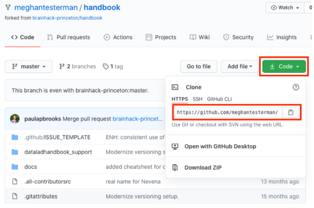

.. _contribute:

=================
How to contribute
=================

Thank you for your interest in contributing to this handbook!

This handbook is still under construction and there are severals ways you can contribute to our efforts, such as submitting an `issue <https://github.com/brainhack-princeton/handbook/issues/new/>`_ or a pull request, or by having a discussion with anyone on the Pygers team in a non-GitHub communication channel!

On this page, we will address the following topics to help you contribute to the construction of this handbook:

* `Submitting an issue`_
* `Submitting a pull request`_
* `Github cheat sheet`_
* `Contributing cheat sheet`_

.. raw:: html

    
    

.. role:: blue
.. role:: red

.. _ShortAnchor:

Submitting an issue
===================

`Issues <https://github.com/brainhack-princeton/handbook/issues/new/>`_ can be used to keep track of bugs, enhancements, suggestions, and the like! Instructions for how to do this can be found `in this link <https://guides.github.com/features/issues/>`_. You can submit an issue along with a pull request if you have suggestions about how to resolve the issue. However, you can submit an issue by itself and someone else can take lead on trying to incorporate your suggestion or resolve the bug.

Submitting a pull request
=========================

You can also contribute via a pull request, which would allow you to write code that can be merged to the official handbook repo (i.e., that can end up on the world wide web). There are still plenty of chapters that need to be written and your contributions will be invaluable.

Here, we are going to delineate the steps needed to render the notebook locally on your computer so that you can make edits and test them, along with the steps needed to submit a pull request:

* `Things to set up once`_
* `Organization of the repo`_
* `Editing the website`_

*Things to set up once*
-----------------------

In order to have a copy of the repo on your local computer and render the website locally (which are necessary to set up the workflow to contribute), these are the **steps you need to do only once**. You don't have to do these steps again after things are up and running locally!

1. First, you have to go to the `Github repo <https://github.com/brainhack-princeton/handbook>`_ for the handbook and **fork it**:

.. image:: ../images/fork_repo.png
  :width: 700px
  :align: center
  :alt: fork the repo!
  :class: with-border

*In the image above, the red box highlights the button you need to press to fork the original handbook repo.*

* Follow the instructions that appear on the page to fork the repo to the correct location. 

2. After you successfully fork the repo, you want to **clone your fork of the repo** on your local computer. From there, you can make edits using your favorite text editor.

* Navigate to the forked repo on your GitHub account.
* Click on "Clone or download" and copy the URL.

  
*In the image above, the red box highlights the button you need to press to get the URL to clone the repo. The arrow points to info about the location of the original repo you forked.*

* In your terminal window, change directory to the location where you want the clone of the repo to live. Then, clone the repo using the URL you copied in the previous step.

.. code-block:: bash

    # change directory to where you want to clone the repo (e.g., on Mac)
    cd ~/Desktop/princeton_handbook/
    # clone the repo
    git clone [URL]

3. Next, you want to **create a conda environment** where you can install all of the necessary requirements to render the notebook locally. 

.. code-block:: bash

    # create conda environment called "princeton_handbook"
    conda create --name princeton_handbook python=3
    # activate the conda environment "princeton_handbook"
    conda activate princeton_handbook

* *NOTE: You will have to activate this conda environment whenever you work on the notebook.*

4. Now, you want to **download important packages** that are needed to render the website locally. In the folder :blue:`handbook`, you will find two files :blue:`setup.py` and :blue:`requirements.txt` that are needed to install the necessary packages.

.. code-block:: bash

    # change directory to the 'handbook' folder
    cd handbook/
    # use python to install via 'setup.py'
    python setup.py install
    # use pip to install requirements via 'requirements.txt'
    pip install -r requirements.txt

5. Since some of the artwork/files we use might be .svg files, you also need to **install librsvg** in order to render those files.

.. code-block:: bash

    # install librsvg
    conda install -c conda-forge librsvg

6. Add the official handbook repository as the **upstream remote**.

.. code-block:: bash

    # add official repo as the upstream remote
    git remote add upstream https://github.com/brainhack-princeton/handbook

* :red:`Why are we doing this?` We want your local repo to point to two different remotes (or places on GitHub where code is stored). The first one should be the **origin**, which should point to your forked repo on GitHub. The second one should be **upstream**, which should point to the original handbook repo on Github. Having this organization will allow you to pull changes from the upstream branch so that you can make edits on the most up-to-date version of the repo, while allowing you the flexibility to do work on your fork. To check that all of this holds true, run the following commands on your terminal:

.. code-block:: bash
    
    # view the remotes you currently have
    git remote
    # view the url of the git repo the origin remote points to
    git remote get-url origin
    # view the url of the git repo the upstream remote points to
    git remote get-url upstream

* You also want to set your master branch to track the upstream remote:

.. code-block:: bash
    
    # fetch the latest changes (but doesn't merge changes into your local files)
    git fetch upstream
    # track the upstream remote branch 
    git branch -u upstream/master

*Organization of the repo*
--------------------------

If everything in the section above went well, you should have your forked repo on your local computer and a conda environment that has all of the necessary installations to render the handbook locally. Before we talk about how you can make edits, we first want to describe the organization of the repo to give you a sense of where things are!

Although the cloned repo directory has lots of files and directories, you are only going to work from the sub-directory :blue:`docs`. 

.. image:: ../images/path_to_content_pages.png
  :width: 600px
  :align: center
  :alt: screenshot of path to content pages
  :class: with-border

*The image above highlights the location of the* :blue:`docs` *(in a red box) in reference to other files in the repo.*

Specifically, chances are that you will just make changes to the .rst files in the folder :blue:`content_pages`. 

    * **IMPORTANT:** You should NOT make changes to the filenames in the :blue:`content_pages` folder unless you also change the :blue:`contents.rst.inc` or (better yet) talk with Paula to make sure that changing a filename doesn't break other things.

Here, we also want to highlight the location of the .html files that will be generated when you render the handbook locally (:blue:`handbook/docs/_build/html`):

*The image above highlights the location of the* :blue:`html` *folder (in a red circle) in reference to other files in the repo, along with the location of the* :blue:`index.html` *file (in the red box).*

When you want to preview the handbook locally (once you generate the .html files), you will want to open :blue:`index.html`. This will open the home page of the handbook on your internet browser. It is important to understand that these .html files are a local version of the website for you to preview how things look. Any modifications you make won't render on the public version of the website until your pull request has been approved.

*Editing the website*
---------------------

Now that you have a general sense of how the repo is organized (and how you will render the handbook locally on your browser), we will delineate the general workflow for making edits and eventually submitting pull requests.

1. First, make sure you have **activated your conda environment** and are working in the correct directory: 

.. code-block:: bash

    # change directory to be in the outermost folder of the repo
    cd ~/Desktop/princeton_handbook/handbook

    # activate the conda environment
    conda activate princeton_handbook

2. **Pull any new commits in the official handbook repo** to keep your master branch up to date:

.. code-block:: bash

    # fetches and merges the remote changes to your local files
    git pull --ff-only

    # push the commits to your forked repo
    git push origin master

* You have to do ``git push origin master`` in order to push any changes that you pulled from the original handbook repo (**upstream**) to your forked repo (**origin**). If there weren't any new commits pulled from the upstream repo, you can skip this step.

.. note::
    
    You won't be able to push changes you make directly to the official handbook repo. Instead, you will have to submit pull requests and the moderators of the repo will review your pull request and decide if any changes need to be made before they accept and merge your changes into the official handbook repo.

    For this reason, it is **highly recommended** that you don't make any changes to the `master` branch of your forked repo. Instead, there should be a 1-to-1 relationship between a feature you want to change and a pull request. In other words, you should create a new branch for every issue you want to change so that you can submit separate pull requests for every thing you want to modify.

3. When you start working on a new feature (i.e., modification), **create/checkout a new branch** for that feature:

.. code-block:: bash

    # create and switch to new branch called 'new-feature' 
    git checkout -b [new-feature]
      e.g., git checkout -b testing

4. Using your favorite text editor, **make changes to the the document you want to modify**. Remember, you should be modifying the .rst files located in :blue:`handbook/docs` or :blue:`handbook/docs/content_pages`.

5. Next, you will want to **render the handbook locally** so that you can get a sense of the impact of the changes you make on the website. Run the following command from your top-level handbook directory: 

.. code-block:: bash

    # build the website locally
    make build

* The output on your terminal will look something like the screenshot below, with the location of the html pages living in the location circled in blue. 

.. image:: ../images/make_build_output.png
  :width: 400px
  :align: center
  :alt: output you get after 'make build'
  :class: with-border

* Open up Finder and navigate to the directory :blue:`handbook/docs/_build/html`. Open :blue:`index.html`. This will open a local version of the handbook in your internet browser. On a Mac, you can use the ``open`` command; e.g., ``open ~/Desktop/princeton_handbook/handbook/docs/_build/html/index.html``.

.. important::

    Use this opportunity to (a) view your changes and (b) make sure that your changes haven't messed up the rendering of the handbook!!

* If you decide to make more modifications to the .rst file and want to view your changes, simply ``make build`` again in your terminal, then refresh the browser window that is displaying :blue:`index.html` and you should see your new modifications rendered.

6. When you're happy with your edits, you'll want to **add, commit, and push your changes to your feature branch** in your forked repo.

* When you're making changes, it might be easy to lose track of which files were modified. You can use ``git status`` to view the files that were changed in the working directory.

.. image:: ../images/screenshot_git_status.png
  :width: 500px
  :align: center
  :alt: screenshot of output for 'git status'
  :class: with-border

.. code-block:: bash

    # remind yourself of which files have been modified
    git status

    # add a modified file in the working directory to the staging area
    git add docs/content_pages/[filename].rst
      e.g., git add docs/content_pages/01-01-howto.rst

    # check to make sure that you added the modified file to the staging
    git status

.. image:: ../images/screenshot_git_status2.png
  :width: 500px
  :align: center
  :alt: screenshot of 2nd output for 'git status'
  :class: with-border

.. code-block:: bash

    # commit the change with an informative message
    git commit -m "Added new content to how-to file"

    # push modified files to your feature branch on your fork:

    # the *first* time you push to your new feature branch on your fork
    git push --set-upstream origin [new-feature]
      e.g., git push --set-upstream origin testing

    # for *subsequent* pushes to this feature branch
    git push

7. Once you are satisfied with the changes you have pushed to your forked repo, you are ready to **submit a pull request**! This can be done directly on terminal, but the instructions below show how you can submit and manage a pull request from the GitHub online interface.

.. important::

    Before you submit a pull request, make sure you have used ``make build`` to check that your code renders the handbook locally on your computer!!

* On the Github page of your forked repo, make sure that you pushed the changes you committed (see where the arrow is pointing below) and that you are in the correct new-feature branch (in the dotted circle). **Press 'new pull request'** to initiate a new pull request (in the solid box).

8. Leave any comments in the text box and then **submit the pull request by pressing 'Create pull request'**, which is boxed in below.

.. image:: ../images/making_pull_request.png
  :width: 600px
  :align: center
  :alt: screenshot of making a pull request
  :class: with-border

*The dotted box above also shows you information about what repo (on the right) you are trying to merge, via a pull request, to the original handbook repo (on the left). You want to make sure that you see a notice saying that the branches are able to merge!*

9. Congratulations! You have submitted a pull request. You will now have to **wait for a moderator to review your changes and merge your pull request into the official repo**. 

.. image:: ../images/pull_request_screenshot.png
  :width: 700px
  :align: center
  :alt: screenshot of after submitting a pull request
  :class: with-border

* However, this sometimes doesn't happen right away. The moderators might want you to make some changes before accepting your merge request. If this is the case, they will contact you.

10. If your pull request gets approved and is merged to the offical handbook, **delete the branch** for the feature that was just approved. You can do this from the terminal or from the GitHub page for your forked repo.

*On terminal*:

.. code-block:: bash

    ## delete the branch remotely (on your forked repo)
    git push <remote_name> --delete <branch_name>
      e.g., git push origin --delete testing

    ## delete the branch on your local computer
    git branch -d <branch_name>
      e.g., git branch -d testing

*On GitHub*:

* Go to the branches tab on your forked repo:

* Find the branch you want to delete, and press the trash can icon.

*Contributing cheat sheet*
-------------------------
Here is a condensed version of the previous section, delineating the steps you typically need to execute when contributing to the website. 

.. code-block:: bash

    # activate the conda environment
    conda activate princeton_handbook
    
    # confirm you're in the correct working directory
    pwd # should be [PATH TO HANDBOOK]/handbook
    
    # confirm that you're in the master branch
    git branch # 'master' should be highlighted green
    
    # NOTE: if not in the master branch, switch to it!
    git checkout master

    # fetch and merge remote changes to local files, and push
    git pull --ff-only
    git push origin master

    # create new branch where you'll do your work
    git checkout -b [new-feature]
    
    # make sure you're in the new branch
    git branch # '[new-feature]' should be highlighted green

    # build website locally
    make build

    # check modifications, add them, make a message, and push
    git status
    git add docs/content_pages/[filename].rst
    git commit -m "[MESSAGE]"
    git push --set-upstream origin [new-feature]

    # submit a pull request
    ## go to the URL that shows up after the previous step
    ## it's under "Create a pull request for '[new-feature]' on GitHub by visiting:"
    ## and submit the pull request from the website

    #  delete your local copy of the branch, after going to the master branch
    git checkout master
    git branch -d [new-feature]

Github cheat sheet
==================

The tutorial above is just the tip of the iceberg of all the things that you can (and may want to) do using git and GitHub. The cheat sheet below goes into more detail about the various things that you can do!

.. image:: ../extra_files/Github_Cheat_Sheet.png
  :width: 600px
  :align: center
  :alt: github cheat sheets
  :class: with-border

Download the GitHub Cheat Sheet :download:`here. <../extra_files/Github_Cheat_Sheet.pdf>`

reStructuredText references
===========================

The content pages you might want to edit are in reStructuredText, or rst. This file format is relatively straightforward, but here are some useful resources you can use to get the most out of using rst:

- `reStructuredText Primer <https://www.sphinx-doc.org/en/2.0/usage/restructuredtext/basics.html>`_
- `reStructuredText Markup Specification <https://docutils.sourceforge.io/docs/ref/rst/restructuredtext.html>`_

