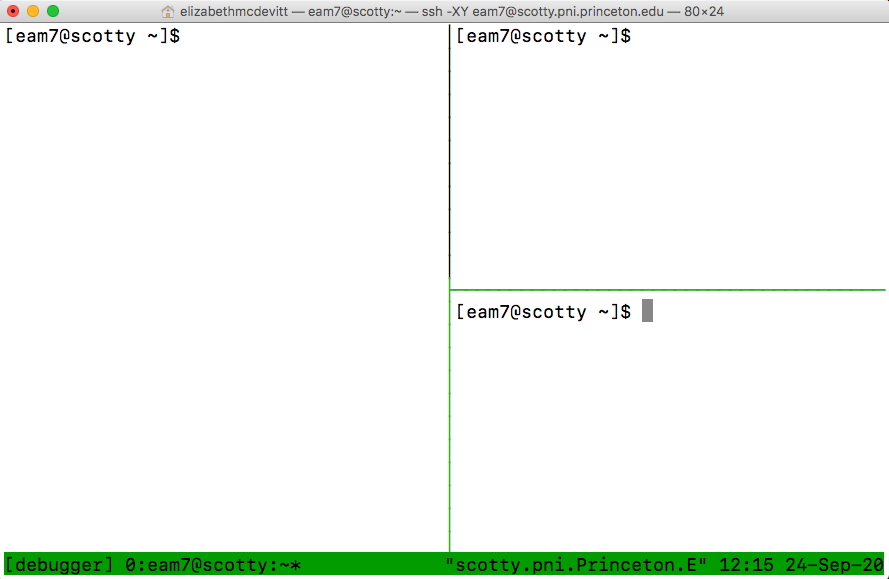

:orphan:

=================================
Jamal's IPython Debugger Tutorial
=================================

.. raw:: html

    
    
    
    

.. role:: blue
.. role:: red
.. role:: orange
.. role:: green

Credit: Jamal Williams, Pygers meeting 9/3/20

**Description:** Use IPython to walk through python scripts in a more “interactive” way for debugging purposes (e.g., break at specific lines, print variables -- essentially, the command line becomes a bit more “matlab-like”).

Tutorial:
=========

**Prep:**

* This tutorial will use tmux. If you are unfamiliar with tmux, check out our `guide to using tmux <./tmux.html>`_.

* We will also be using IPython (i.e., an enhanced Interactive Python). Check out `IPython documentation here <https://ipython.readthedocs.io/en/stable/interactive/index.html>`_.

* If you want to walk through the tutorial below and practice using the different commands, save a copy of our practice script (:blue:`/jukebox/norman/pygers/hack_scripts/ipython_debugger_practice.py`) to your personal directory.

.. image:: ../../images/decorative_line4.png
  :width: 700px
  :height: 8px
  :align: center
  :alt: decorative line

1. Login to your server (spock or scotty at Princeton); make sure you login using the ``-X`` flag to enable XQuartz. Navigate to the directory where you saved a copy of the practice script :blue:`ipython_debugger_practice.py`.

.. code-block:: bash

	$ ssh -X netID@scotty.pni.princeton.edu
	$ cd path/to/your/directory

2. Create a new tmux session OR attach to an existing tmux session. Here, our tmux session is named ‘debugging’.

.. code-block:: bash

	$ tmux new -s debugging #create a new session OR
	$ tmux a -t debugging #attach to an existing session

.. NOTE::
    In the next step, we will start using tmux commands. By default, tmux uses ``ctrl + b`` as the prefix key (you can change this by setting up a :blue:`.tmux.config` file). Note that you must let go of the prefix before entering the subsequent command key.

3. Use tmux commands to split your terminal into 3 separate panes. Jamal’s recommended configuration is one panel on the left and two panels split horizontally on the right (see screenshot below). 

* ``ctrl + b %`` will split your panel vertically

* ``ctrl + b "`` will split your panel horizontally

* In order to jump around the panels, use the arrow keys (e.g., ``ctrl + b <rightarrow>``)

4. *In the left-hand panel:* Open the script you are debugging using `vim <https://vim.rtorr.com/>`_. Alternatively, you can open your script in a text editor and keep it next to your terminal window. Either way, it is handy to have your script available to see the code you are working with or edit code as you go. 

.. code-block:: bash

	$ vim ipython_debugger_practice.py

.. TIP::
    In the lower-right panel, type ``vimtutor``. This will open a vim tutorial that you can keep handy to reference vim commands as you work.

5. In the upper-right panel: Load the pyger module available on the PNI cluster and then get ipython running.

.. code-block:: bash

	$ module load pyger
	$ ipython

6. Your command line in the upper right-hand panel will now look like this, which indicates you running an iPython kernel.

.. code-block:: bash

	In [1]: 

You can exit IPython and return to your regular command line at any point using the ``exit`` command. 

.. code-block:: bash

	In [1]: exit
	$  

7. Go ahead and re-start IPython. We will now run (``%run``) our script in debug mode (``-d``) and define a breakpoint (i.e., the line of code you want to break on). We will break at line 19 (``-b19``). ``%run`` is a built-in magic command, which you can read more about `here <https://ipython.readthedocs.io/en/stable/interactive/magics.html#>`_. This python script requires 2 input arguments: your name and your age. When you run the line of code below, make sure you replace ``arg1`` with your name (e.g. Lizzie) and ``arg2`` with your age (e.g. 33).

.. code-block:: bash

	$ ipython
	In [1]: %run -d -b19 ipython_debugger_practice.py arg1 arg2

.. TIP::
    Make sure the line you are breaking at is not empty and not a comment; it must be a real line of code. If you are using vim, notice that vim tells you the line number of your cursor in the bottom of the terminal window.

8. The debugger will always stop at line 1 and you will be prompted to enter ``c`` to continue execution. Go ahead and do that, then the script will next break at line 19 like we asked it to. When you are in the debugger, your command line will look like this: 

.. code-block:: bash

	ipdb>
	ipdb> c 

9. We have run the script up to, but not including, line 19. Along the way, we defined two variables on lines 16 and 17. We can easily check what info is contained in those variables by calling them on our command line (without using a ``print`` command!):

.. code-block:: bash

	ipdb> my_name
	‘Lizzie’
	ipdb> my_age
	‘33’

10. Let’s run the next line of code (line 19) using the debugger. We will use the command ``n`` for “next”. Then we will check the new variable we defined on line 19:

.. code-block:: bash

	ipdb> n 
	ipdb> intro_statement
	‘Hello, my name is Lizzie and I am 33 years old.’

11. Now let’s tell the debugger to set a new breakpoint at line 27 (``break 27``) and continue (``c``) running the script up to that breakpoint:

.. code-block:: bash

	ipdb> break 27
	ipdb> c 

12. We have now executed all the code between lines 19-27 (but not including 27). Let’s double check this by calling the variable ``x``.

.. code-block:: bash

	ipdb> x

.. code-block:: python
	
	array([ 0.        ,  0.1010101 ,  0.2020202 ,  0.3030303 ,  0.4040404 ,  
	0.50505051,  0.60606061,  0.70707071,  0.80808081,  0.90909091,
	0.50505051,  0.60606061,  0.70707071,  0.80808081,  0.90909091,
	1.51515152,  1.61616162,  1.71717172,  1.81818182,  1.91919192,
	2.02020202,  2.12121212,  2.22222222,  2.32323232,  2.42424242,
	2.52525253,  2.62626263,  2.72727273,  2.82828283,  2.92929293,

	8.58585859,  8.68686869,  8.78787879,  8.88888889,  8.98989899,
	9.09090909,  9.19191919,  9.29292929,  9.39393939,  9.49494949, 
	9.5959596 ,  9.6969697 ,  9.7979798 ,  9.8989899 , 10.        ])  

You can also try calling the variable ``a_plus_b`` (which shouldn’t exist yet). 

.. code-block:: bash

	ipdb> a_plus_b
	*** NameError: name ‘a_plus_b’ is not defined 

13. Something that is cool about the debugger is we can call python commands from the command line, even if they weren’t included in the script. For example, let’s compute the mean of all the values in ``x``.

.. code-block:: bash

	ipdb> np.mean(x)
	5.0 

14. Or we can do more complicated things, like plotting your data. When you run these commands, the plot will show up in a separate window (note: you must have XQuartz or X11 setup, and make sure you logged into the server using the ``-X`` flag).

.. code-block:: bash

	ipdb> plt.plot(x, x, label='linear')
	ipdb> plt.show 

15. Now let’s finish running the script. The script should run to completion because we have not defined any additional breakpoints.

.. code-block:: bash

	ipdb> c 

16. You are now back at your IPython command line. All the variables you defined while running the script in the debugger are saved in your ‘workspace’. To see the variables in your workspace, type ``whos``:

.. code-block:: bash

	You have finished running the ipython debugger practice script!
	
	In [2]: whos

Notice that your workspace includes the variable ``a_plus_b``. 

17. You can also clear your workspace (``%reset``) and check that your workspace is indeed empty (``whos``):

.. code-block:: bash

	In [3]: %reset   
	In [4]: whos 

18. Now I want to check that the whole script is able to run without any errors. I am going to re-run the script without any breakpoints. But I still want to run it “interactively” so that when it has finished running I can still check my variables, workspace, etc.

.. code-block:: bash

	In [5]: %run -i ipython_debugger_practice.py Lizzie 33
 	You have finished running the ipython debugger practice script!
	In [6]: whos

Voila! Now go forth and debug away! 

tmux commands cheat sheet
=========================

.. code-block:: bash

	tmux new -s [name]	# start a new tmux session
	tmux a -t [name]	# attach to an existing session 
	tmux kill-session -t [sessionname]  # terminate target (-t) session
	ctrl+b %		# split window vertically
	ctrl+b “ 		# split window horizontally
	ctrl+b [arrow]		# move to different panes 

IPython commands cheat sheet
============================

IPython command line looks like this: :green:`In [1]:`

.. code-block:: bash

	%run -d script.py 	# run script.py in debugger
	%run -d -b 20 script.py	# run script.py in debugger and break at line 20
	%run -i script.py 	# run whole script in interactive mode
	whos			# print workspace
	%reset			# clear workspace
	exit 			# exit IPython kernel

debugger commands cheat sheet
=============================

debugger command line looks like this: :green:`ipdb>`

.. code-block:: bash
	
	h		# help, show list of available commands
	n 		# run next line of code
	c		# continue through the rest of the script
	s		# step into another function/script
	u		# move up back into original script
	break X 	# break at line X
	<enter>		# repeat the previous command
	list		# show current location in the file
	quit		# quit debugger

`Return to tips and tricks <../06-01-tipsSplashPage.html>`_

