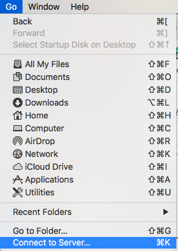

:orphan:

==================================
Tips for navigating the PNI server
==================================

.. raw:: html

    

.. role:: blue

Connecting to the server
========================

If you are not on campus, make sure you have `connected to the Princeton network via VPN <https://princeton.service-now.com/service?sys_id=6023&id=kb_article>`_. 

ssh via the Terminal (Mac)
--------------------------

Open a new Terminal window. You can choose to login to:

* apps (use this if you are simply navigating the fileserver, copying files, etc.) 
* spock (the 'compute cluster')
* scotty (for interactive sessions)

Generally, you probably want to use scotty most of the time for debugging scripts or doing any sort of interactive work on the cluster.

.. code-block:: bash

    # Login to apps or Spock or Scotty
    $ ssh username@apps.pni.princeton.edu
    $ ssh -XY username@spock.pni.princeton.edu
    $ ssh -XY username@scotty.pni.princeton.edu

You can now explore and access files from apps, spock, and scotty by using the following commands and paths from your Terminal command line: 

.. code-block:: bash

    $ cd /jukebox/YOURLAB/
    $ cd /jukebox/scratch/
    $ pwd #print working directory
    $ ls #list files in working directory
    $ cd .. #move back a level in directory structure

.. TIP::
    You can add aliases for each of these ssh commands to your *.bash_profile* on your local machine. Then, each time you want to login to the server, you can simply type ``scotty`` (for example), and this will call the ssh command without having to type out the whole thing! When editing your *.bash_profile*, you will need to use the vim for text editing. 

.. code-block:: bash

    # open .bash_profile
    $ vim ~/.bash_profile

    # using the vim text editor, add the following:
    # alias 'apps'='ssh netID@scotty.pni.princeton.edu'
    # alias 'spock'='ssh -XY netID@scotty.pni.princeton.edu'
    # alias 'scotty'='ssh -XY netID@scotty.pni.princeton.edu'

    # source your .bash_profile for changes to take effect
    $ source ~./bash_profile

.. NOTE::
    If you are working on a MacOS, you will use *.bash_profile*. If you are working on Linux (e.g. the server), the equivalent is *.bashrc*. Keep in mind you can also setup aliases in your ``~/.bashrc`` file on the server!

Mount a volume via Finder (Mac)
-------------------------------

You can also navigate the fileservers (jukebox or scratch) more easily by mounting your lab volume on your local computer. 

Open Finder, Go → Connect to Server 

Server Address:

To access *jukebox*:
smb://bucket.pni.princeton.edu/[YOURLAB]

To access *scratch*:
smb://sink/scratch

Click “Connect” 

.. image:: ../../images/connect-to-server2.png
  :width: 600
  :align: center
  :alt: connect to server2

If it’s your first time, you will be asked to enter your Princeton netID and password (PU password). 

.. NOTE::
    It may be more convenient to mount the volume and open files on your local computer for certain tasks, such as opening/editing your scripts and visualizing data (e.g. using fsleyes). 
 
    In order to access files on the mounted volume via a Terminal on your *local machine* (not from servers like spock, scotty, apps), your directory paths will be as follows:

    * Lab volume on jukebox: ``/Volumes/YOURLAB/YOURDIR``
    * Scratch: ``/Volumes/scratch/YOURDIR``

Mount a volume via another file browser (Windows)
-------------------------------------------------

From Windows Explorer, select "Map Network Drive" and enter the share name using one of the paths below. Select "Connect using a different user name". Authenticate with your NetID and PU password. When prompted for your username, enter PRINCETON\netid (note that PRINCETON can be upper or lower case) where netid is your PU NetID.

Paths to use:

To access *jukebox*: ``\\bucket\YOURLAB``

To access *scratch*: ``\\sink\scratch\`` 

OR ``\\sink\scratch\YOURDIR`` (your personal scratch volume if you've already created it)

Restoring data from snapshots
=============================

At PNI, each lab has a volume on the :blue:`/jukebox` file server. Jukebox (or bucket) has a snapshot feature that enables users to restore, by themselves, files that they have mistakenly deleted. All lab volumes retain snapshots. Snapshots are taken daily and weekly. For lab volumes, daily snapshots are kept for 14 days and weekly snapshots for 4 weeks. Snapshots are taken overnight (at different times depending on the volume), so this feature can only capture files that are present when the snapshot is taken. Data created and then deleted in a single day will not be captured in a snapshot.

The :blue:`/scratch` volume does not have snapshots and is not backed up. It is recommended that you save your working files (with lots of intermediate files) and data undergoing analyses in :blue:`/scratch`, and then save your final results to lab volumes on :blue:`/jukebox`.

In order to access snapshots: 

.. code-block:: bash

    # cd to the directory where the data you need to restore (used to) live:
    $ cd /jukebox/YOURLAB/YOURDIR/

    # snapshots are hidden files, in order to see them:
    $ ls .snapshot

    # choose the snapshot (the version of your files) you want to restore
    # and move into that directory
    $ cd .snapshot/norman_daily_2020_12-06-_01-15/
    $ ls #list files in this snapshot version
    
    # copy the snapshot version of a file back to your main directory (or wherever you want it)
    $ cp -r <snapshot-filename> <path-to-copy-to>

Finding your MRI data on 'conquest'
===================================
At the end of each of your data collection sessions at the PNI scanners, you are supposed to transfer your data to “conquest.” Conquest is a directory on the PNI fileserver (aka jukebox or bucket). You can find your transferred data using the following steps: 

.. code-block:: bash

    # Login to the server
    # then navigate to the conquest directory

    # for data collected at Skyra
    $ cd /jukebox/dicom/conquest/Skyra-AWP45031/YOURLAB/YEAR

    # for data collected at Prisma
    $ cd /jukebox/dicom/conquest/Prisma-MSTZ400D/YOURLAB/YEAR

    $ ls

You can see that raw MR data are named by the session ([Scan ID]-[Date of the Scan]-[Start Time]). Inside each of the directories, there is a folder named *dcm* - this is where your raw data (DICOM files) are saved. It takes a little bit of time (depends on the amount of data) to complete the transfer from the scanner, so it is recommended that you wait until all of your raw data have been transferred before moving onto the next steps. 

You’ll want to copy the data from :blue:`/conquest` to your study directory (fyi, data are deleted from :blue:`/conquest` after ~8 weeks). But wait! You don’t have to do this manually. If you’re planning to proceed with using HeuDiConv to convert your DICOM data to BIDS-formatted Nifti files, you should follow the step-by-step instructions on our `Converting data to BIDS using HeuDiConv <../03-02-converting.html>`_ page.

`Return to tips and tricks <../06-01-tipsSplashPage.html>`_

